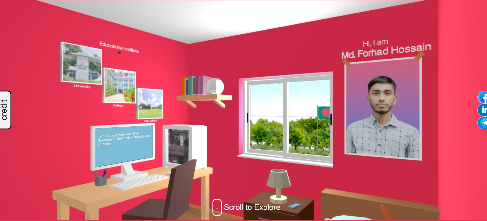

# My 3D Portfolio Website

Hi I'm Md Forhad Hossain. Welcome to my 3D portfolio website built with Three.js! I have created this project just as hobby.

## Website Link: 
[https://m-forhad.github.io/](https://m-forhad.github.io/)

## Technologies Used
- Three.js
- HTML5
- CSS3
- JavaScript
- GitHub Pages for hosting

## Installation
To run this project locally, follow these steps:

1. Clone the repository:
   ```bash
   git clone https://github.com/m-forhad/m-forhad.github.io.git
   ```
2. Navigate to the project directory:
  ```bash
  cd your-repo-name
  ```
3. Open index.html in your browser to view the website.

## Screenshots


## Contributing
If you’d like to contribute to this project, please fork the repository and create a pull request with your changes. Contributions are welcome!

## License
This project is licensed under the MIT License. See the LICENSE file for more details.

## Contact
Feel free to reach out to me via message at [Telegram](http://t.me/mdforhadhossain2004) or connect with me on [LinkedIn](https://www.linkedin.com/in/md-forhad-hossain-1a55a42ba).

_Thank you for visiting my portfolio website!_
